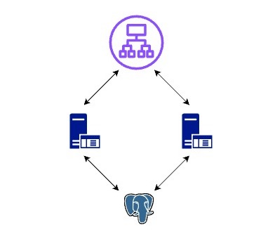

### Запустить развертывание

```shell
make deploy
```

### Очистить стенд

```shell
make clean
```

### Сочинение на тему как я развернул HA (High availability) стенд Bingo

Первым делом внимательно прочитал ТЗ, причем не один раз.
Потом выстроил архитектуру сервисов и как они между собой общаются.
Так как в ТЗ было упомянуто что нужно запустить Бинго сервис на двух нодах ради отказоустойчивости, 2 ВМ я выделил для них, далее так как Бинго сервисы соединяются с БД постгрес я выделил один для него. И чтобы распределять входящий трафик на 2 ноды мне понадобился еще один ВМ балансировщик нагрузки.



Начал я запуск бинарника у себя локально в компьютере. Загадочный был бинарник, но благодаря лекциям тренировок по Devops запустить бинарник не составила особого труда. Strace, lsof - сделали свое дело.

По началу я хотел сразу начать автоматизировать создание ВМ на Терраформ, но так как я не имел опыта работы с Терраформ раньше я решил начать создавать руками потом руководствуясь документацией заняться автоматизацией.

`Terraform` - для provision и `Ansible` для менеджмента конфигурации.

Начал я с базы данных, для этого мне достаточо было установить `Postgres` через apt.
Потом создал ВМ для Бинго и там же его запустил. Правда `bingo prepare_db` команда заняла около 20 минут для миграции и `bingo run_server` занимает 30 секунд для запуска. Чтобы бинарник работал в фоновом режиме и перезапускался при ошибках я сделал его сервисом systemd написав соответствуюший "bingo.service" файл в директории "/etc/systemd/system" ([bingo.service](./bingo/bingo.service)). Казалось бы все просто, запустил бинарник, соединил с БД и работает. Но, не тут то было, бинарник переодически падает и отвечает "We all gonna die" на все запросы, и чтобы все тесты прошли успешно нужно было его мониторить и систематически чекать url */ping* на статус кода **200**, для этого я написал shell script ([monitor_bingo.sh](./bingo/monitor_bingo.sh)
) который каждый 30 секунд делает *GET* запрос и сверяет http код ответа и если код отличный от 200 то скрипт его перезапускает командой `systemctl restart bingo`. И чтобы этот чекер работал на фоне его я тоже сделал сервисом аналогичным образом ([monitor_bingo.service](./bingo/monitor_bingo.service)). Почему 30 секунд вы спросите, потому что бинарник запускается в 30 секунд и если в это время его проверит чекер он посчитает его убитым и перезапустит, а бинарник так и не успеет полностью запуститься. Это все что касается сервиса Бинго.

Для балансировки нагрузки я выбрал `HAProxy`. Он удобен, имеет понятный конфиг и дает возможность хорошо проконтролировать upstream серверы. Можно указать url и способ определения health check-a. Так как из каробки он не поддерживает кэширование, я добавил сервис `Varnish` для кэширование ответов ручек согласно ТЗ. Создал самоподписанный сертификат и сделал поддержку **http3**. Для этого мне пришлось собрать `HAProxy` из исходников указав нужные параметры. Для мониторинга запросов, ошибок и тд. `HAProxy` из коробки поддерживает экспортировать метрики в формате prometheus и чтобы было легче все это визуализировать я настроил `unified-agent` от `YandexCloud`.
